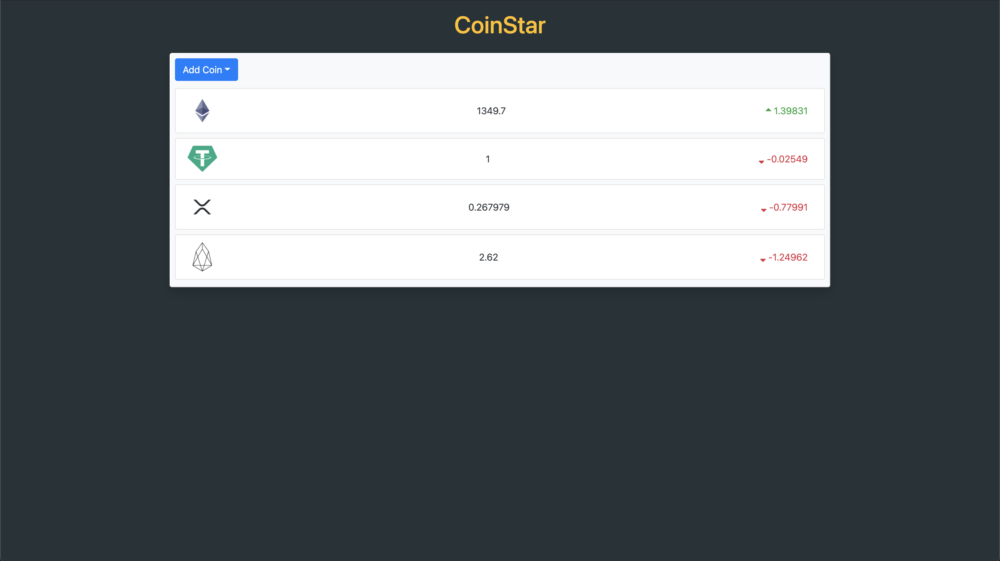
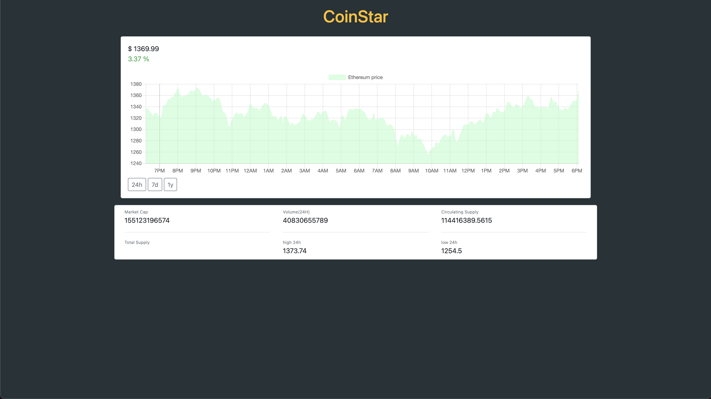

# coinstart-app

coinstar-app is a cryptocurrency application built using ReactJS, Bootstrap, and chart.js.

## Installation

Clone the repo and use npm to install dependencies.

```bash
npm install
```

## Usage

Click on one of the coins to see more information. Use the "Add" button to choose from a list of cryptocurrencies.

## Screenshots




## Authors and acknowledgment

This application was created using a YouTube video by Sanjeev Thiyagarajan.

YouTube video: https://www.youtube.com/watch?v=3m-3qnEXIUk

## License

[MIT](https://choosealicense.com/licenses/mit/)
